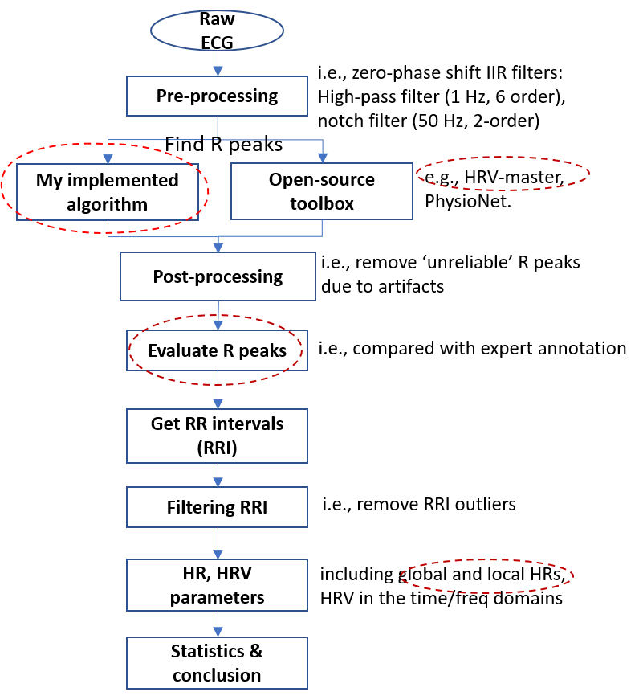
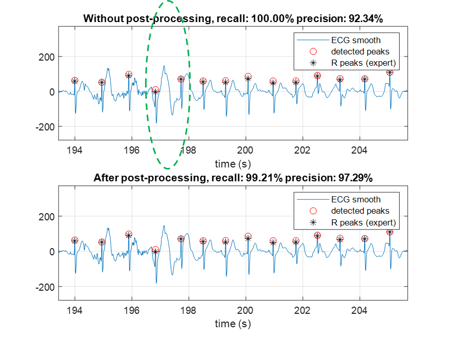
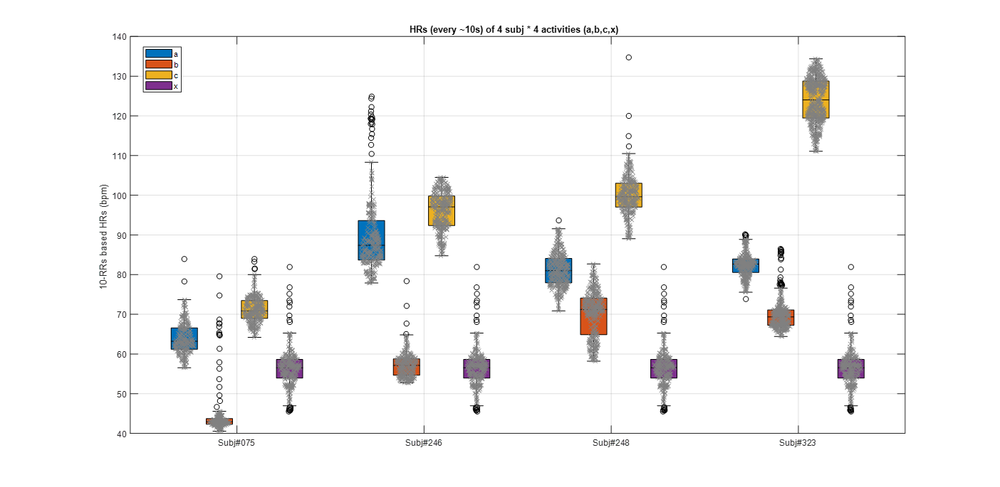

# Estimate-HR-and-HRV-from-raw-ECG
A MATLAB project for estimating HR and HRV parameters from raw ECG signals.

pipeline:

    </a>

Quick demos:

    </a>

    </a>

I recommend to run the following three .m files one by one to understand the automated figure results better.

(1)	ECG_pipline.m, it shows the analysis pipeline and plot detailed results on one lead ECG signals.
(2)	ECG_batch_process.m, it shows the batch processing of four subjects, only important results are plot.
(3)	results_statistic.m, it pool-over 4*4 activities HRs so that some statistic analysis can be done here.
